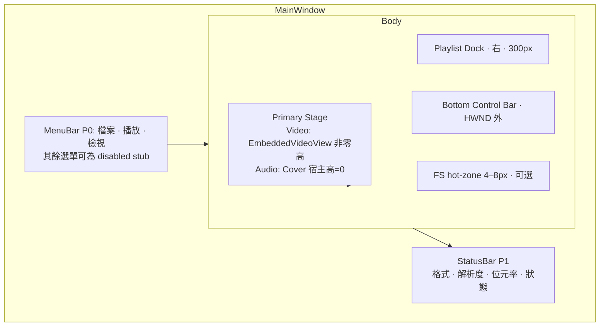
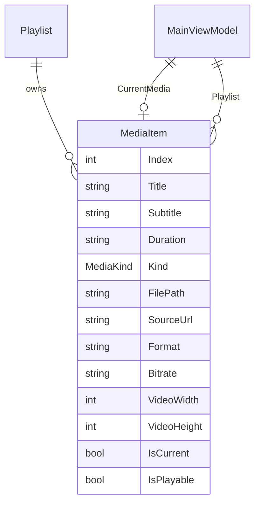
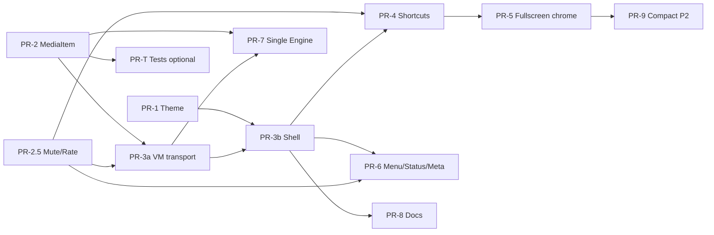

# 設計文件：FengBroPlayer33 UI/UX 重構（KMPlayer / PotPlayer 原型導向）

| 欄位 | 內容 |
|------|------|
| **文件標題** | Redesign UI/UX — Stage-Centric Pro Media Player |
| **作者** | （待填） |
| **日期** | 2026-08-07 |
| **狀態** | Draft（rev 0.3 — 再審修訂） |
| **工作區** | `D:\codex\FengBroPlayer33` |
| **技術棧** | AvaloniaUI 12 · CommunityToolkit.Mvvm · LibVLCSharp · TagLibSharp · Traditional Chinese UI |

---

## Overview

現有 FengBroPlayer33 以 Spotify 風格的深色媒體庫為設計語言：左側導覽欄、音樂／影片雙面板上下堆疊、紫系漸層卡片與示範社群互動（讚／留言）。這與用戶要求參考的 **KMPlayer / PotPlayer** 體驗差異很大——後者是以 **影片舞台為主畫布**、底部密集控制列、可開關播放清單 dock、選單列與右鍵選單為核心的「本機威力型桌面播放器」。

本設計將主視窗重構為 **stage-centric（舞台中心）** 架構：單一主要媒體串流、共用底部 transport bar、可切換右側播放清單、音訊時舞台顯示封面／視覺化、影片時以 `EmbeddedVideoView` 填滿舞台。視覺語言為 **Pro Dark**（中性深灰 + 鎖定 accent `#3B9EFF`），保留中文文案與 LibVLC 實際播放能力，並嚴格遵守 HWND airspace 限制。

**P0 對影片舞台指標手勢採 keyboard-primary 策略**（見 KD-8 / §3）：原生 HWND 會吞掉 Avalonia 指標事件，不可承諾「點在影像像素上即暫停」除非另開原生輸入路徑（P2）。

---

## Background & Motivation

### 現況架構（已於程式碼驗證）

| 元件 | 路徑 | 職責 |
|------|------|------|
| 主視窗 XAML | `Views/MainWindow.axaml` | 單一整體視窗：`Grid ColumnDefinitions="240,*"` 側欄 + 主區；主區 `RowDefinitions="Auto,*,*"`（工具列 / 音樂 / 影片） |
| 主視窗 code-behind | `Views/MainWindow.axaml.cs` | 檔案挑選、拖放、seek pointer、`PrepareVideoHost`、極簡快捷鍵（Ctrl+O、Space→音樂） |
| ViewModel | `ViewModels/MainViewModel.cs` | 雙引擎 `_audio` / `_video`、Tracks / UpNextVideos、開啟檔案／網路 URL、seek、volume |
| 播放引擎 | `Services/MediaEngine.cs` | LibVLC 薄封裝；`requireVideoHost` 防止浮動視窗 |
| 視訊宿主 | `Controls/EmbeddedVideoView.cs` | Windows child HWND via `NativeControlHost`；`DestroyNativeControlCore` 會清 `MediaPlayer.Hwnd` |
| 主題 | `Styles/AppTheme.axaml`, `Styles/Controls.axaml` | 紫系 accent `#8B6CFF`、圓角卡片、nav-item / transport / chip |
| 模型 | `Models/TrackItem.cs`, `VideoItem.cs`, `NavItem.cs`, `PlaylistItem.cs` | 音樂與影片分型；VideoItem 含 Likes/Comments 等社群欄位 |

**雙引擎行為現況：**

- `SelectTrack` 會 `_video.Pause()` 再播音訊（`MainViewModel.cs` ≈ L410–416）。
- `SelectVideo` 會 `_audio.Pause()` 再播影片（≈ L442–451）。
- ViewModel 維護兩套 progress／position／duration 與兩套 play/toggle 指令；UI 同時露出兩組 transport。
- `Space` 僅呼叫 `ToggleMusicPlayCommand`，與「目前活躍媒體」無關。
- `ToggleMusicPlay` 在 pause 後可經 `Player.Media is not null` 再 `Play()` 恢復；**若改為 `Stop()`，Media 可能被清掉，必須以 path 重播**（見 §6.3）。

**Airspace 現況（必須保留）：**

```xml
<!-- MainWindow.axaml 註解（≈ L469–471、L534） -->
<!-- Layout: video surface and controls are SEPARATE rows.
     Native HWND airspace must not cover the seek bar, or scrubbing is impossible. -->
```

seek bar、transport、以及任何需要 pointer 的 Avalonia 控制項必須在 `EmbeddedVideoView` **配置邊界之外** 的視覺樹中（兄弟列／兄弟欄，而非 HWND 上的 overlay）。

**PR / Code review 硬性檢查項：**

> **No Avalonia control that requires pointer input is a visual descendant overlapping `EmbeddedVideoView`’s arranged bounds.**

### 痛點（對照 KM / Pot）

1. **永久雙面板堆疊**：音樂上、影片下，舞台不是主角。
2. **串流 App 側欄 + mini player**：導覽權重高於播放控制。
3. **Transport 卡片化、功能稀疏**：缺 stop、fullscreen、playlist toggle、速度等 power 入口。
4. **缺經典 chrome**：選單列、右鍵選單、always-on-top、標題列顯示媒體名、compact mode。
5. **播放清單分裂**：音樂清單 vs「接下來播放」影片佇列；無統一 dock。
6. **無模式切換**：無法 cinema / fullscreen 與 library 流暢切換。
7. **YouTube 風格社交 chips**：與本機播放器定位不符。
8. **Airspace**：重設計時必須繼續把控制列放在 HWND 外；且不可假設指標事件能穿透 HWND。

### 動機

用戶明確要求「重新設計，參考原型 KMPlayer 和 PotPlayer」。產品應從「媒體庫瀏覽 App」轉型為「本機 power media player」，同時保留既有 LibVLC 播放、拖放、網路 URL、中文 UI 等能力，並以可審查的增量 PR 落地。

---

## Goals & Non-Goals

### Goals

| 優先級 | 目標 |
|--------|------|
| **P0** | Stage-centric 主殼：舞台填滿客戶區；音樂／影片不再永久上下堆疊 |
| **P0** | 共用底部 transport bar（**Stop**、play/pause、prev/next、seek、volume、mute、fullscreen、playlist toggle、open） |
| **P0** | 可開關播放清單面板（預設右側，固定寬 300） |
| **P0** | 音訊模式：舞台顯示封面／視覺化；影片模式：`EmbeddedVideoView` |
| **P0** | Pro Dark 主題 tokens（accent 鎖定 `#3B9EFF`） |
| **P0** | 鍵盤快捷鍵（含 Space 對活躍媒體、F/Esc 全螢幕、M mute、P playlist） |
| **P0** | **音訊舞台** 可選右鍵選單／點擊暫停／滾輪音量（Avalonia 路徑） |
| **P0** | **影片舞台** 以鍵盤 + transport + 選單為主；不承諾影像像素上的 Avalonia 手勢 |
| **P0** | 維持 LibVLC + `EmbeddedVideoView` airspace 規則；使用者可見字串 **zh-TW** |
| **P0** | 統一 `MediaItem` 播放清單 + next/prev / AutoPlay 語意（KD-11） |
| **P1** | 選單列 power 功能（播放速度、畫面比例 placeholder、always-on-top、開啟網路串流） |
| **P1** | Fullscreen chrome + 控制列 auto-hide（Window 級 pointer + 底部 hot-zone） |
| **P1** | 狀態列（format / bitrate；resolution 需擴充 metadata） |
| **P2** | Compact mode、A-B UI、字幕檔 UI、等化器 stub、LibVLC/Win32 原生舞台手勢、多 skin |

### Non-Goals

- 複製 KMPlayer / PotPlayer 品牌、logo 或專有 skin
- 替換 LibVLC 或改回 LibVLCSharp.Avalonia 內建 `VideoView` 作為預設宿主（**保留現有 `EmbeddedVideoView`**）
- v1 完整 codec pack / 硬體解碼控制台
- 行動版或 Web 版
- 逆向工程專有格式或 skin 檔
- P0 在影片像素上實作可靠的 click-to-pause / 滾輪 / context menu（需原生路徑，屬 P2）

---

## Key Decisions

| # | 決策 | 理由 |
|---|------|------|
| **KD-1** | **單一主要媒體**：任一時刻一個活躍串流；切換時對另一引擎 **`Stop()`**（非 `Pause()`）。P0 保留雙 `MediaEngine` 實例；PR-7 可合併為單一引擎 | 對齊 KM/Pot；簡化 transport；`Stop` 後恢復必須 `Play(path/url)` 重開 media |
| **KD-2** | **`Playlist: ObservableCollection<MediaItem>` 為唯一真相來源**；殼層 PR 起廢除 UI 對 `Tracks`/`UpNextVideos` 的雙寫。PR-2 過渡期可保留舊集合為 **投影／同步副本** 以通過編譯 | 避免雙寫；`IsCurrent` 對齊清單高亮（語意等同舊 `IsPlaying`） |
| **KD-3** | **Chrome 模式：`Normal` / `Fullscreen` / `Compact`（Compact = P2）**；`WindowState.FullScreen` 進出由 View 執行 | Avalonia API 正確名稱；系統 FullScreen 隱藏標題列，不另做無邊框自訂 chrome（除非未來另開） |
| **KD-4** | **Pro Dark + 鎖定 accent `#3B9EFF`**；背景 `#0D0D0D`–`#1E1E1E`。使用者主題挑選屬 P2 | PR-1 視覺 QA 需要單一預設；拉開與舊 Spotify 紫距離 |
| **KD-5** | **移除社交 chips**；P0 seed：**1 筆音訊 demo + 1 筆影片 demo**（無檔案、無 likes/comments） | 可預覽清單列樣式；空狀態文案仍引導開啟檔案 |
| **KD-6** | **側欄預設移除**（選單／開啟檔案承載導覽）；不實作常駐 Spotify drawer | 對齊 power player IA |
| **KD-7** | **Airspace 硬規則**：任何需 pointer 的控制不得與 `EmbeddedVideoView` 配置區重疊；transport／seek 在 stage **下方兄弟列** | 現有註解與實測；fullscreen 亦用 row 高度折疊，禁止像素上 overlay fade |
| **KD-8** | **舞台指標分模式**：**Audio** — Avalonia 單擊 pause、滾輪音量、右鍵選單可用。**Video（P0）** — 不依賴 HWND 上的 Avalonia 指標；以 Space／transport／選單／快捷鍵為主。滾輪音量在影片模式僅當游標在 **非 HWND 區域**（控制列、hot-zone、playlist）時由 Avalonia 處理。雙擊全螢幕在影片模式標為 **best-effort / 鍵盤優先（F）** | 修正「Border 包 HWND 卻綁 PointerPressed」的錯誤承諾 |
| **KD-9** | **增量 PR**：主題 → 模型／引擎 API → VM transport 統一 → shell → 快捷鍵 → fullscreen chrome → 選單／狀態列 → 可選單引擎 → 文件 | 每 PR 可 build／review；避免 PR-3 巨型變更 |
| **KD-10** | **MVVM**：`WindowState` / `Topmost` / HWND / 拖放 / seek pointer **僅 View**；播放、佇列、`CurrentChrome` 邏輯在 VM。`CurrentChrome` 為 chrome 可見性單一真相；View 訂閱並套用視窗狀態，避免重入 | 延續 `PickFilesAsync` / `PrepareVideoHost` |
| **KD-11** | **統一佇列語意**：`Playlist` 順序 = 匯入順序（append）。**Next / Prev / EndReached（AutoPlay）一律強制跳過 `!IsPlayable` 列**，前進至下一個／上一個可播放項（到達端點時依現有循環策略 wrap；若清單中**無任何**可播放項 → `Stop` + zh-TW 狀態「清單中沒有可播放的媒體」）。Demo 列**僅**在使用者明確點選清單列時進入示範 UI 狀態（不啟動引擎）。混合開啟只 **auto-play 第一個新加入且可播放的項目一次**；`AutoPlay` 預設 **true**。P1 篩選 Tab 為 **檢視過濾**，不改底層佇列順序；next/prev 仍掃完整 `Playlist`（略過不可播放項） | 消除 OpenMedia 雙 Select 競態；next/prev 與 end-reached 行為一致 |
| **KD-12** | **影片宿主生命週期（P0）**：**音訊／None 模式將 `EmbeddedVideoView` 列高（或宿主高度）collapse 為 0**，接受可能的 native destroy；下次播片走既有 `PrepareVideoHost` + 重試。**禁止** 以「非零面積可見 HWND + 上方 Avalonia 面板」假裝可點封面。不在 P0 使用 `Opacity=0` 全尺寸 HWND 蓋住舞台 | 解決 IsVisible 與 hit-test 矛盾；與現有 retry 對齊 |

---

## Proposed Design

### 1. 目標資訊架構



### 2. 主視窗佈局（Avalonia 結構草案）

**現況：**

```
Grid 240 | *
  Sidebar (nav + mini player)
  Main: Auto | * | *   → top bar | music panel | video panel
MinWidth=1100, MinHeight=720
```

**目標（Normal 模式）：**

```
Grid RowDefinitions="Auto,*,Auto,Auto"   // Menu | Stage+Playlist | Transport | Status(P1)
  Row0: MenuBar
  Row1: Grid ColumnDefinitions="*,Auto"
        Col0: Stage (含可 collapse 的 VideoHost 區 + 音訊封面)
        Col1: Playlist Width=300, IsVisible=IsPlaylistVisible
              （隱藏時不佔位：IsVisible=false 即可）
  Row2: Transport（含可選上方 4–8px hot-zone 合併進此列）
  Row3: StatusBar（P1；P0 可用 transport 旁 StatusMessage）

Window: MinWidth=800, MinHeight=560（側欄移除後放寬小窗；預設仍可 1280×800）
```

建議 XAML 骨架（概念）：

```xml
<Window Title="{Binding WindowTitle}"
        MinWidth="800" MinHeight="560"
        Width="1280" Height="800"
        KeyDown="OnWindowKeyDown"
        PointerMoved="OnWindowPointerMoved"
        DragDrop.AllowDrop="True">
  <Grid RowDefinitions="Auto,*,Auto,Auto">
    <!-- P0 Menu: 檔案 / 播放 / 檢視；其他可 IsEnabled=false stub -->
    <Menu Grid.Row="0" IsVisible="{Binding IsMenuBarVisible}">
      <MenuItem Header="檔案(_F)">
        <MenuItem Header="開啟檔案…" Command="{Binding OpenMediaCommand}" InputGesture="Ctrl+O" />
        <MenuItem Header="開啟網路串流…" Command="{Binding OpenNetworkUrlCommand}" />
        <MenuItem Header="結束" Command="{Binding ExitCommand}" />
      </MenuItem>
      <MenuItem Header="播放(_P)">
        <MenuItem Header="播放/暫停" Command="{Binding TogglePlayCommand}" />
        <MenuItem Header="停止" Command="{Binding StopMediaCommand}" />
      </MenuItem>
      <MenuItem Header="檢視(_V)">
        <MenuItem Header="播放清單" Command="{Binding TogglePlaylistCommand}" />
        <MenuItem Header="全螢幕" Command="{Binding ToggleFullscreenCommand}" />
      </MenuItem>
    </Menu>

    <Grid Grid.Row="1" ColumnDefinitions="*,Auto">
      <!--
        Stage height matrix (KD-12) — implementers MUST use BOTH bindable heights.
        Do NOT leave the audio row hard-coded as "*" while video is also "*".

        | Mode         | Row0 VideoHost | Row1 Audio/Idle |
        |--------------|----------------|-----------------|
        | Video        | *              | 0               |
        | Audio / None | 0              | *               |
      -->
      <Grid Grid.Column="0" x:Name="StageRoot" Background="#0D0D0D">
        <Grid.RowDefinitions>
          <RowDefinition Height="{Binding VideoHostRowHeight}" />   <!-- * or 0 -->
          <RowDefinition Height="{Binding AudioStageRowHeight}" />  <!-- 0 or * -->
        </Grid.RowDefinitions>

        <!-- Primary mechanism: height collapse (KD-12). IsVisible is optional secondary;
             height-0 alone is enough — avoid relying only on IsVisible for layout. -->
        <ctrl:EmbeddedVideoView x:Name="VideoHost" Grid.Row="0"
            MediaPlayer="{Binding VideoMediaPlayer}" />

        <!-- Audio / idle only: Grid.Row="1", NO RowSpan (two-row grid) -->
        <Border Grid.Row="1"
                PointerPressed="OnAudioStagePointerPressed"
                PointerWheelChanged="OnAudioStageWheel"
                DoubleTapped="OnAudioStageDoubleTapped">
          <Border.ContextMenu>
            <!-- P0 context menu: 僅音訊/idle 舞台保證可用；影片模式用 MenuBar -->
          </Border.ContextMenu>
          <!-- cover + visualizer OR empty-state 文案；列高為 0 時自然不可見/不可點 -->
        </Border>
      </Grid>

      <Border Grid.Column="1" Width="300"
              IsVisible="{Binding IsPlaylistVisible}"
              Background="{StaticResource BgPanelBrush}">
        <!-- dense rows: Index | Title | Duration；IsCurrent 高亮 -->
      </Border>
    </Grid>

    <!-- Transport + optional hot-zone: NEVER inside VideoHost bounds -->
    <Grid Grid.Row="2" RowDefinitions="Auto,Auto">
      <Border Height="6" Background="Transparent"
              IsVisible="{Binding IsFullscreenHotZoneVisible}"
              PointerEntered="OnHotZoneEntered" />
      <Border Grid.Row="1" Classes="control-bar"
              Height="{Binding ControlBarHeight}"
              IsVisible="{Binding IsControlBarVisible}">
        <!-- §4 transport controls -->
      </Border>
    </Grid>

    <Border Grid.Row="3" Classes="status-bar" IsVisible="{Binding IsStatusBarVisible}" />
  </Grid>
</Window>
```

> **Stage 列高矩陣（實作必遵，與 §9 / KD-12 一致）：**
>
> | Mode | `VideoHostRowHeight` (Row0) | `AudioStageRowHeight` (Row1) |
> |------|-----------------------------|------------------------------|
> | `MediaKind.Video` | `*`（吃滿 stage） | `0` |
> | `MediaKind.Audio` 或 `None` | `0` | `*` |
>
> 以兩個可綁定 `GridLength`（或 code-behind 設定兩個 `RowDefinition.Height`）同步切換；**禁止**第二列寫死 `*` 導致影片模式宿主只佔一半。`Grid.RowSpan` 不使用。高度 collapse 為 KD-12 **主機制**；不必再疊 `IsVisible=false` 當唯一手段。

**Fullscreen 模式（`WindowState.FullScreen`）：**

- View 將 `Window.WindowState` 設為 `WindowState.FullScreen`（**不是** `FullWindow`——該名稱不存在）。
- 退出：`Esc` 或 `F` toggle → `WindowState.Normal`，並還原進入前保存的 `WindowState`（若進全螢幕前是 `Maximized` 則回到 `Maximized`）。
- 系統 FullScreen 隱藏標題列；**不做** 自訂 borderless chrome（P0/P1 範圍外）。
- MenuBar / Status 在 `CurrentChrome == Fullscreen` 時隱藏。
- **Playlist：** 進入 FS 時保存 `_playlistVisibleBeforeFs` 並設 `IsPlaylistVisible=false`；FS 期間使用者仍可用 `P`/選單再打開；**退出 FS 時還原 `_playlistVisibleBeforeFs`**（見 §6.1 `OnCurrentChromeChanged`）。不得每次 F 切換都丟棄使用者進 FS 前的 playlist 偏好。
- Transport：**row 高度折疊**（見 §2.1），禁止在 HWND 像素上做 opacity overlay。

**Compact 模式（P2）：** 小窗僅標題 + 迷你 transport + 可選進度。

#### 2.1 Fullscreen auto-hide（可實作的端到端規格）

| 項目 | 規格 |
|------|------|
| **狀態** | `CurrentChrome == Fullscreen` 時啟用；另有 `IsControlBarVisible`（bool） |
| **顯示觸發** | `Window.PointerMoved`（整窗，含 chrome／transport／playlist／hot-zone）。**不**依賴 stage 內部 HWND 上的 Avalonia move |
| **Hot-zone** | 底部 4–8px 透明列，**位於 VideoHost 配置區外**（transport 列之上或合併於 Row2）；`PointerEntered` / move 到此區 → 顯示 control bar |
| **計時器** | 歸屬 **View code-behind**（`DispatcherTimer` 2.5s）；每次合格 move 重啟；**scrubbing（`_isSeeking`）期間取消隱藏** |
| **隱藏** | 將 control bar 目標高度設 0 或 `IsControlBarVisible=false`（綁定高度）；**非** overlay fade on video pixels |
| **非目標** | 半透明控制列畫在影像上、依賴 HWND 內 move 來顯示 |
| **狀態機** | `EnterFS` → show bar + start timer → (move\|hotzone\|seek) → reset timer → timeout → hide bar → move → show… → `ExitFS` → show bar 常駐、停表 |

### 3. 舞台（Stage）行為

#### 3.1 分模式輸入政策（修正 airspace）

| 輸入 | Audio / Idle 舞台（無非零 HWND） | Video 舞台（HWND 呈現中） |
|------|----------------------------------|---------------------------|
| 單擊 | Play/Pause（Avalonia） | **P0 不支援**（指標進 HWND）。用 Space 或 transport |
| 雙擊 | Toggle Fullscreen | **Best-effort**；**主路徑為 `F`**。P0 不實作 Win32 subclass |
| 滾輪 | 音量 ±5% | 僅當游標在 transport／hot-zone／playlist／選單等 Avalonia 區；**影像上無效** |
| 右鍵選單 | Avalonia `ContextMenu`（P0 完整） | **P0 用 MenuBar**；影像上右鍵不承諾。P2 可評估 LibVLC/Win32 |
| 拖放檔案 | 視窗級 `DragDrop`（既有，與 stage 無關） | 同左（視窗級） |
| 鍵盤 | 全域快捷鍵（§7） | 同左 — **影片模式主控** |

**右鍵／選單內容（P0 最小集，音訊 ContextMenu + MenuBar 共用命令）：**

- 開啟檔案…
- 播放 / 暫停 / 停止
- 播放清單（toggle）
- 全螢幕
- （P1）播放速度、畫面比例 placeholder、永遠置頂
- （P2）截圖

**風險（高）：** 若未來產品堅持「點影片畫面暫停」，必須開 **P2 原生輸入** 工作項（LibVLC mouse callback 或 child HWND subclass），並更新平台支援矩陣；**不可**僅在 XAML 祖先綁 `PointerPressed`。

### 4. 底部控制列（Transport）— P0 凍結清單

| 區域 | 控制項（P0 **必做**） | 綁定 |
|------|----------------------|------|
| 左 | **Stop**、Prev、Play/Pause、Next | `StopMediaCommand`, `PlayPreviousCommand`, `TogglePlayCommand`, `PlayNextCommand` |
| 左可選 | ±10s 按鈕 | `SeekRelativeCommand` ±10；與鍵盤 ±5 / Shift±30 **並存**（按鈕可略，快捷鍵必做） |
| 中 | `PositionText` · Seek `Slider` · `DurationText` | `Progress`；`BeginSeek`/`EndSeek` |
| 右 | Mute、Volume、Playlist toggle、Fullscreen、Open | `ToggleMuteCommand`, `Volume`, `TogglePlaylistCommand`, `ToggleFullscreenCommand`, `OpenMediaCommand` |

**UI 細節：**

- 列高約 48–56px；按鈕 28–32px；主播放鈕 36–40px。
- 沿用 `Slider.seek` hit-target。
- Tooltip **全中文**。
- 波形不作為 seek UI。

**Seek 數值約定：**

| 來源 | 偏移 |
|------|------|
| 鍵盤 ← / → | −5s / +5s |
| 鍵盤 Shift+← / → | −30s / +30s |
| Transport 可選按鈕 | −10s / +10s |

### 5. 播放清單 Dock

**Dense row：**

```
[ 12 ]  檔名或標題              03:42
         副標（藝術家 / 本機影片）
```

- 雙擊或 Enter：`SelectMedia`。
- 高亮：`IsCurrent`（非舊名 `IsPlaying`，語意相同）。
- 工具列：開啟檔案、清除、自動播放 `AutoPlay`。
- P1 篩選 Tab：全部／音樂／影片 — **僅過濾 `ItemsControl` 視圖**，不改 `Playlist` 順序；next/prev 仍掃完整清單並**強制略過 `!IsPlayable`**（KD-11）。
- Demo 列可點選以顯示示範 UI，但 **Prev/Next/AutoPlay 永不停在 demo 列**。
- 寬度 P0 固定 300；拖曳改寬 P2。

### 6. ViewModel 變更設計

#### 6.1 屬性（對齊專案 `partial` + `[ObservableProperty]` 風格）

```csharp
public enum ChromeMode { Normal, Fullscreen, Compact }
public enum MediaKind { None, Audio, Video }

// --- Chrome / layout ---
[ObservableProperty] public partial ChromeMode CurrentChrome { get; set; } = ChromeMode.Normal;
[ObservableProperty] public partial bool IsPlaylistVisible { get; set; } = true;
[ObservableProperty] public partial bool IsMenuBarVisible { get; set; } = true;
[ObservableProperty] public partial bool IsControlBarVisible { get; set; } = true;
[ObservableProperty] public partial bool IsStatusBarVisible { get; set; } = true;
[ObservableProperty] public partial bool IsAlwaysOnTop { get; set; }
[ObservableProperty] public partial double PlaybackRate { get; set; } = 1.0;

// --- Single primary media ---
[ObservableProperty] public partial MediaKind ActiveMediaKind { get; set; } = MediaKind.None;
[ObservableProperty] public partial MediaItem? CurrentMedia { get; set; }
[ObservableProperty] public partial bool IsPlaying { get; set; }
[ObservableProperty] public partial double Progress { get; set; }
[ObservableProperty] public partial string PositionText { get; set; } = "00:00";
[ObservableProperty] public partial string DurationText { get; set; } = "00:00";
[ObservableProperty] public partial string WindowTitle { get; set; } = "鋒兄播放器";
[ObservableProperty] public partial bool IsMuted { get; set; }
[ObservableProperty] public partial string StatusMessage { get; set; } = "就緒 — 可開啟本機音樂或影片檔案";
[ObservableProperty] public partial string StatusDetail { get; set; } = "";
[ObservableProperty] public partial bool AutoPlay { get; set; } = true; // KD-11
[ObservableProperty] public partial double Volume { get; set; } = 1.0;

// Stage flags: stored props so bindings notify (do NOT use expression-only getters alone)
[ObservableProperty] public partial bool IsVideoStage { get; set; }
[ObservableProperty] public partial bool IsAudioStage { get; set; }

// HWND 綁定：Stage A 仍綁 _video.Player（音訊不走此 Player 輸出畫面）
public MediaPlayer VideoMediaPlayer => _video.Player;

// GridLength helpers — expose as bindable props or set RowDefinition from View on kind change
// VideoHostRowHeight:  * if Video else 0
// AudioStageRowHeight: 0 if Video else *

partial void OnActiveMediaKindChanged(MediaKind value)
{
    IsVideoStage = value == MediaKind.Video;
    IsAudioStage = value == MediaKind.Audio;
    // Sync both row heights together (matrix in §2); View may also listen and assign RowDefinition.Height
    VideoHostRowHeight = value == MediaKind.Video ? GridLength.Star : new GridLength(0);
    AudioStageRowHeight = value == MediaKind.Video ? new GridLength(0) : GridLength.Star;
}

// Saved when entering Fullscreen; restored on exit (Issue: playlist vanish on every F toggle)
private bool _playlistVisibleBeforeFs = true;

partial void OnCurrentChromeChanged(ChromeMode value)
{
    if (value == ChromeMode.Fullscreen)
    {
        _playlistVisibleBeforeFs = IsPlaylistVisible;
        IsPlaylistVisible = false; // enter FS: hide; user may re-open with P / menu while still FS
        IsMenuBarVisible = false;
        IsStatusBarVisible = false;
        IsControlBarVisible = true; // show first; View timer may auto-hide
    }
    else if (value == ChromeMode.Normal)
    {
        IsPlaylistVisible = _playlistVisibleBeforeFs; // restore pre-FS preference
        IsMenuBarVisible = true;
        IsStatusBarVisible = true; // P1 status bar
        IsControlBarVisible = true;
    }
    // View applies WindowState via RequestFullscreen / ExitFullscreen
}
```

> **禁止** 僅寫 `public bool IsVideoStage => ActiveMediaKind == MediaKind.Video` 而不在 kind 變更時 `OnPropertyChanged`——綁定不會更新。

#### 6.2 指令合流

| 現有 | 目標 |
|------|------|
| `ToggleMusicPlay` / `ToggleVideoPlay` | `TogglePlay` — 依 `ActiveMediaKind` 與活躍引擎 |
| `MusicProgress` / `VideoProgress` | `Progress` + 單一 `_isSeeking` |
| `PlayPrevious` / `PlayNext` | 掃 `Playlist`，**強制**找上／下一個 `IsPlayable`（KD-11；無則 Stop + 狀態） |
| `SeekVideoRelative` | `SeekRelative(double seconds)` |
| （無） | `StopMedia`, `TogglePlaylist`, `ToggleFullscreen`, `ToggleMute`, `SetPlaybackRate` |

#### 6.3 雙引擎操作狀態表（Stage A）與事件配線

**活躍引擎選擇：** `ActiveMediaKind == Audio` → `_audio`；`Video` → `_video`；`None` → 無。

| 操作 | Audio 活躍時 | Video 活躍時 |
|------|----------------|----------------|
| `SelectMedia(audio)` | `_video.Stop()`；`_audio.Play(path)` 或 demo 狀態 | 同左 |
| `SelectMedia(video)` | `_audio.Stop()`；`PrepareVideoHost`；`_video.Play(path\|url, requireVideoHost: true)` | 同左 |
| `TogglePlay` pause | `_audio`：`Pause()`（保留 media 以便續播） | `_video.Pause()` |
| `TogglePlay` resume | 若 `Player.Media != null` → `Play()`；**否則** `Play(FilePath)` 重開 | 同理 + `PrepareVideoHost` |
| `StopMedia` | 活躍引擎 `Stop()`；`IsPlaying=false`；`Progress=0`；**不**自動清 `CurrentMedia` | 同左 |
| `Stop` 後再 Play | **一律** `Play(path/url)` 重開 media（不可假設 Stop 後 Media 仍可續播） | 同左 |
| `SeekRatio` / `SeekBySeconds` | 僅活躍引擎 | 僅活躍引擎 |
| `Volume` 變更 | **兩個引擎都寫入**（切換時音量一致；成本低） | 同左 |
| `Mute` | 活躍引擎 `Mute` 或 volume=0 + `_volumeBeforeMute`；建議兩引擎同步 mute 狀態 | 同左 |
| `SetRate` | 活躍引擎 `SetRate`；切換媒體時重套 `PlaybackRate` | 同左 |
| `TimeChanged` | **只處理活躍引擎回呼**；非活躍忽略或退訂 | 同左 |
| `EndReached` | 活躍引擎 → `OnPrimaryEndReached`（AutoPlay → **下一個 IsPlayable**，與 Prev/Next 同一尋找規則） | 同左 |
| `PlayingChanged` | 僅活躍引擎更新 `IsPlaying` | 同左 |

**事件配線（Stage A）：**

```text
建構：兩者 TimeChanged/EndReached/PlayingChanged 都訂閱
處理器開頭：
  if (!ReferenceEquals(senderEngine, ActiveEngine)) return;
或維護 _active 並在 SelectMedia 時不依賴 sender（用 ActiveMediaKind 分支讀取對應引擎時間）
```

**Resume-after-Stop 政策：**

- `Pause` ↔ `Play()`：可走現有 `Player.Media is not null` 路徑。
- `Stop` 之後：LibVLC 常無法直接 `Play()` 空 media → **`Play(CurrentMedia.FilePath | SourceUrl)`** 並重置 progress 標籤。

**Stage B（單一引擎，PR-7）附加規則：**

- 播純音訊前：可 `Player.Hwnd = IntPtr.Zero` 或接受短暫黑場；**文件預設：播音訊時清空 HWND 綁定並 collapse 宿主高**，避免殘留最後一幀。
- 切換 `EmbeddedVideoView.MediaPlayer` 時：`OnMediaPlayerChanged` 會把舊 player 的 Hwnd 置零——**PR-7 若仍單 player 則勿反覆換綁定**；僅 `EnsureAttached`。
- Dispose：先 Stop → 清 Hwnd → Dispose player/LibVLC（視窗 `Closed` 既有路徑）。

```mermaid
sequenceDiagram
    participant UI as MainWindow
    participant VM as MainViewModel
    participant A as MediaEngine audio
    participant V as MediaEngine video
    participant Host as EmbeddedVideoView

    UI->>VM: SelectMedia(item)
    alt item is Video
        VM->>A: Stop()
        VM->>VM: ActiveMediaKind=Video; ignore A events
        VM->>Host: PrepareVideoHost + row height expand
        VM->>V: Play(path, requireVideoHost:true)
    else item is Audio
        VM->>V: Stop()
        VM->>VM: ActiveMediaKind=Audio; ignore V events
        VM->>Host: collapse VideoHost row height to 0
        VM->>A: Play(path)
    end
    VM->>UI: Progress / IsPlaying / WindowTitle / IsVideoStage
```

#### 6.4 `MediaItem` 模型與所有權

```csharp
// Models/MediaItem.cs
public partial class MediaItem : ObservableObject
{
    public required int Index { get; set; }
    public required string Title { get; init; }
    public string Subtitle { get; init; } = "";
    public required string Duration { get; init; }
    public required MediaKind Kind { get; init; }
    public string? FilePath { get; init; }
    public string? SourceUrl { get; init; }
    public string CoverHue { get; init; } = "200";
    public string Format { get; init; } = "";
    public string Bitrate { get; init; } = "";
    public int VideoWidth { get; init; }   // 0 if unknown
    public int VideoHeight { get; init; }

    public bool IsLocalFile => !string.IsNullOrWhiteSpace(FilePath);
    public bool IsNetworkSource => !string.IsNullOrWhiteSpace(SourceUrl);
    public bool IsPlayable => IsLocalFile || IsNetworkSource;

    [ObservableProperty] public partial bool IsCurrent { get; set; };
}
```

**所有權規則：**

1. **`Playlist` 是唯一可寫真相**；`ReindexPlaylist()` 在每次 insert/remove/clear 後執行（今日僅 `ReindexTracks`）。
2. **PR-2：** 可暫時同步填寫 `Tracks` / `UpNextVideos` **投影**，供舊 XAML 編譯與顯示；投影只讀自 `Playlist`，禁止反向雙寫。
3. **PR-3b（shell）合併後：** 刪除或完全停止維護 `Tracks`/`UpNextVideos` UI 綁定；demo seed 只寫 `Playlist`（1 audio + 1 video，`IsPlayable=false`）。
4. `VideoItem` record / `with` 語意不再用於播放路徑；新代碼用可變 `MediaItem`。

#### 6.5 匯入與 auto-select（KD-11）

```text
OpenMedia / Drop 混合檔：
  依 paths 順序將 audio/video 辨識後 append 至 Playlist（穩定：可先全部分類再按原 paths 順序插入）
  firstPlayable = 第一個新加入且 IsPlayable 的項目
  若 firstPlayable != null → SelectMedia(firstPlayable) 恰好一次
  // 禁止：先 SelectTrack 再 SelectVideo 導致連播兩次、最後一項「贏」

PlayNext / PlayPrevious / OnPrimaryEndReached(AutoPlay)：
  從 CurrentMedia 索引向 ±1 掃描 Playlist（可 wrap 一圈）
  跳過所有 !IsPlayable（含 demo）
  找到 → SelectMedia(that)
  找不到任何其他可播放項 → StopMedia；StatusMessage =「清單中沒有可播放的媒體」
  // 與「可選跳過」不同：略過為強制，三路徑同一 helper，例如 FindPlayable(fromIndex, direction)

明確點選 demo 列：
  CurrentMedia = demo；ActiveMediaKind 可設；IsPlaying 視覺可切
  不呼叫引擎 Play；StatusMessage 提示開啟本機檔

Clear：Stop 活躍引擎；P0 清除本機項、保留 2 demo
```

### 7. 鍵盤快捷鍵（P0）

| 按鍵 | 行為 |
|------|------|
| `Space` | 活躍媒體 Play/Pause（TextBox 焦點時忽略） |
| `←` / `→` | Seek −5s / +5s |
| `Shift+←` / `→` | Seek −30s / +30s |
| `↑` / `↓` | Volume ±5% |
| `F` | `ToggleFullscreenCommand` |
| `Esc` | 若 `CurrentChrome==Fullscreen` → Exit |
| `Ctrl+O` | 開啟媒體 |
| `M` | `ToggleMuteCommand`（依賴 PR-2.5 Mute API） |
| `P` | Playlist toggle（Fullscreen 下亦可） |
| `S` | `StopMedia`（非輸入框） |
| `Ctrl+T` | Always on top（P1） |

集中於 `MainWindow.OnWindowKeyDown` → VM commands。

### 8. 主題：Pro Dark tokens（已鎖定）

| Token | 現值（約） | **鎖定目標** |
|-------|------------|--------------|
| `BgDeepColor` | `#0B0D14` | `#0D0D0D` |
| `BgAppColor` | `#10131C` | `#121212` |
| `BgPanelColor` | `#151925` | `#1A1A1A` |
| `BgCardColor` | `#1A1F2E` | `#1E1E1E` |
| `BgSelectedColor` | `#2A2550` | accent @ ~20% 或 `#1A3050` |
| **`AccentColor`** | `#8B6CFF` | **`#3B9EFF`** |
| `BorderSubtleColor` | `#242A3A` | `#2A2A2A` |
| Corner | Lg 14 / Pill | 控制列 `RadiusSm` 4–6 |

`Controls.axaml`：新增 `control-bar` / `playlist-row`；縮小 `play-main`；弱化紫粉漸層。

### 9. 音訊舞台與 VideoHost 生命週期（KD-12 實作說明）

| 模式 | VideoHost 列高 (Row0) | Audio/idle 列高 (Row1) | 指標 |
|------|----------------------|------------------------|------|
| `MediaKind.Video` | `*`（**整段** stage，非一半） | `0` | 影像上 Avalonia 不可靠；快捷鍵/transport |
| `MediaKind.Audio` / `None` | `0` | `*`（封面可命中） | Avalonia 手勢 OK |
| 切回 Video | Row0=`*`、Row1=`0` + `PrepareVideoHost` + ≤10×50ms 重試 | — | 驗證無浮動 OS 窗 |

**手動測試（必做）：** audio → video → audio → video；影片模式目視宿主應佔滿 stage（非上下半屏）。無雙音軌、無 LibVLC 獨立頂層窗、transport 可 seek。

不在 P0 使用：全尺寸 `Opacity=0` HWND、`IsHitTestVisible=false` 蓋住封面卻仍佔 airspace；**禁止**「Row0=`*` 且 Row1=`*`」骨架。

### 10. 與現有檔案的映射

| 動作 | 檔案 |
|------|------|
| Layout / Menu / transport | `Views/MainWindow.axaml` |
| 快捷鍵、FS timer、hot-zone、audio stage 指標、HWND prepare | `Views/MainWindow.axaml.cs` |
| 屬性／指令／佇列／互斥 Stop | `ViewModels/MainViewModel.cs` |
| 新模型 | `Models/MediaItem.cs` |
| 主題 | `Styles/AppTheme.axaml`, `Styles/Controls.axaml` |
| **Mute / SetRate** | `Services/MediaEngine.cs`（**PR-2.5**，非延到 PR-6 才加 API） |
| 宿主 | `Controls/EmbeddedVideoView.cs` — 行為原則不變；列高由外部 layout 控制 |
| **Metadata 擴充** | `Services/MediaMetadata.cs`：`VideoInfo` 增加 `Width`/`Height`/`Bitrate`；`ReadVideo` 讀 TagLib `Properties.VideoWidth/Height`、`AudioBitrate`（可能為 0——UI 顯示「—」） |
| 可選測試 | 新 `FengBroPlayer33.Tests`：`MediaMetadata.IsAudio/IsVideo`、`Reindex`、路徑 kind（**非阻塞**） |

### 11. 空狀態、示範資料、字串語言

- 無媒體：舞台中央「開啟檔案、拖放，或按 Ctrl+O」。
- Seed：**1 audio demo + 1 video demo**，無 likes/comments、無觀看次數。
- 網路 URL：選單「開啟網路串流…」；**所有 status / placeholder / 驗證錯誤改 zh-TW**，例如：
  - 「請輸入有效的 http:// 或 https:// 媒體網址」
  - 「正在播放網路影片：{title}」
  - 「無法播放此網路影片，請檢查網址或 LibVLC 支援」
- P0/P1 驗收：**使用者可見字串不得殘留英文 UI**（除技術專有名詞如 URL、Ctrl+O）。
- i18n 資源檔：P2 可選；P0 硬編碼 zh-TW 可接受。

---

## API / Interface Changes

### View ↔ ViewModel 契約

| 成員 | 方向 | 說明 |
|------|------|------|
| `PickFilesAsync` | View → VM | 保留 |
| `PrepareVideoHost` | View → VM | 保留 |
| `RequestFullscreen` | VM → View | `Action?`：View 存 `_stateBeforeFs`，設 `WindowState.FullScreen` |
| `ExitFullscreen` | VM → View | `Action?`：還原 `_stateBeforeFs`（`Normal` 或 `Maximized`） |
| `SetTopmost` | VM → View | `Action<bool>?`（P1） |
| `RequestClose` | VM → View | `Action?`：Menu「結束」/`ExitCommand` → `RequestClose?.Invoke()` → View `Close()`（或 `Application.Current?.Shutdown()`）。**僅 View 關閉視窗**（KD-10） |
| `ImportDroppedPaths` | View → VM | 保留 |
| `BeginSeek` / `EndSeek` | View → VM | 單一 seek 旗標 |

### Fullscreen / Topmost 接線草圖（防重入）

```csharp
// MainWindow.axaml.cs — OnOpened
_stateBeforeFs = WindowState;
vm.RequestFullscreen = () =>
{
    if (WindowState != WindowState.FullScreen)
        _stateBeforeFs = WindowState;
    WindowState = WindowState.FullScreen;
};
vm.ExitFullscreen = () =>
{
    WindowState = _stateBeforeFs == WindowState.FullScreen
        ? WindowState.Normal
        : _stateBeforeFs;
};
vm.SetTopmost = value => Topmost = value;
vm.RequestClose = () => Close(); // Menu ExitCommand → Exit() in VM → RequestClose

// ToggleFullscreenCommand in VM:
//   if (CurrentChrome != Fullscreen) { CurrentChrome = Fullscreen; RequestFullscreen?.Invoke(); }
//   else { CurrentChrome = Normal; /* OnCurrentChromeChanged restores playlist */ ExitFullscreen?.Invoke(); }
// NotifyExitedFullscreen(): set CurrentChrome=Normal so _playlistVisibleBeforeFs is restored
// View 不直接改 IsPlaylistVisible；系統 ESC 導致 WindowState 變化時呼叫 NotifyExitedFullscreen
```

**單一真相：** `CurrentChrome` 驅動 Menu/Playlist/Status/ControlBar 可見性；**僅 View** 碰 `WindowState` / `Topmost` / `Close()`。

### MediaEngine 擴充（PR-2.5 即落地 API）

```csharp
private int _volumeBeforeMute = 100;

public void SetRate(float rate) => Player.SetRate(Math.Clamp(rate, 0.25f, 4f));

public bool Mute
{
    get => Player.Mute;
    set => Player.Mute = value;
}

// 若某些後端 Mute 不可靠，ToggleMute 可改：
// volume=0 並保存 _volumeBeforeMute，取消靜音時還原
```

### 移除或降級的 UI 綁定

- 雙 transport → 單一 `TogglePlayCommand` / `Progress`
- Likes/Comments chips → 移除
- 側欄 mini player → 移除
- 舊 `Tracks`/`UpNextVideos` 綁定 → shell PR 後移除

---

## Data Model Changes



**`MediaMetadata.VideoInfo` 擴充（PR-6 或附帶 metadata 小 PR）：**

```csharp
public sealed record VideoInfo(
    string Title,
    string Channel,
    string Duration,
    string Format,
    TimeSpan Length,
    int Width,      // TagLib Properties.VideoWidth; 0 if unknown
    int Height,
    string Bitrate  // 可為 "—" 
);
```

TagLib 對部分容器回 0×0 時 UI 顯示「—」；日後可改讀 LibVLC track 資訊（非 P0）。

**遷移：** 無 DB。`Playlist` 擁有權見 §6.4。

---

## Alternatives Considered

### A1. 保留雙面板但可折疊

- **結論：** 否決為終態（非 KM/Pot IA）。

### A2. P0 一步合併單一 MediaEngine

- **結論：** 目標贊成，**分 PR-7**；P0 用雙實例 + 互斥 Stop。

### A3. 僅換皮 Spotify 殼

- **結論：** 否決。

### A4. 雙佇列 + Tab UI 不統一 MediaItem

- **結論：** 否決為終態；PR-2 直接 `MediaItem`，僅過渡投影舊集合。

### A5. 舞台輸入策略（與 Issue 1 對應）

| 方案 | 做法 | 優點 | 缺點 | 結論 |
|------|------|------|------|------|
| A5-a | P0 放棄影片像素手勢；鍵盤+transport | 實作簡單、無假承諾 | 少了「點畫面暫停」 | **P0 採用** |
| A5-b | LibVLC mouse/key 回呼或 Win32 subclass | 接近 KM/Pot | 平台碼、所有權、測試重 | **P2 候選** |
| A5-c | 影片四周非 HWND 邊框接收手勢 | 部分手勢可用 | 損 stage 沉浸、仍非點在畫面 | 可作 P1 增強，非必須 |

### A6. Soft-pause 互斥（現況）vs hard Stop（KD-1）

| | Pause 另一引擎 | Stop 另一引擎 |
|--|----------------|---------------|
| 恢復延遲 | 低（media 仍在） | 需重開 path（稍高） |
| 裝置／解碼資源 | 可能仍佔用 | 釋放較乾淨 |
| 狀態單純度 | 兩引擎都可能 IsPlaying 殘影 | 單一活躍較清晰 |

**結論：** 採 **Stop**；活躍引擎內部 pause/resume 仍用 `Pause`。

### A7. 宿主：`EmbeddedVideoView` vs LibVLCSharp.Avalonia `VideoView`

- 專案已因浮動窗問題自研 HWND 宿主。
- **結論：保留 `EmbeddedVideoView`**；不回到預設 `VideoView` 作為主路徑。

---

## Security & Privacy Considerations

| 主題 | 說明 |
|------|------|
| 本機檔案 | 僅對話框／拖放；不預設全碟掃描 |
| 網路 URL | 使用者提供的 HTTP(S)；限制不合理超長字串；無遙測 |
| 路徑顯示 | 可選僅檔名；截圖隱私 |
| Always-on-top / Fullscreen | 無額外權限 |
| 截圖（P2） | 使用者選定目錄 |

---

## Observability

| 層級 | 策略 |
|------|------|
| 使用者可見 | **zh-TW** `StatusMessage` / `StatusDetail` |
| 除錯 | Debug 可開 LibVLC log；Release 維持 `--quiet` |
| 自動化 | 可選 unit tests（metadata / reindex）— 見 Rollout |
| 無後端告警 | — |

---

## Rollout Plan

1. **不設長期雙 UI feature flag**；以 PR revert 回滾。
2. 每 PR：`dotnet build` + 手動回歸。
3. **回歸清單：**
   - 開啟 mp3 / mp4、拖放混合檔 → **只自動播第一個可播放新項**
   - seek、音量、mute
   - 播片無浮動 OS 窗
   - transport 可點（airspace checklist）
   - Space 控制**活躍**媒體；Ctrl+O
   - audio↔video 多次切換無雙音軌
   - Stop 後再 Play 成功
   - Fullscreen F/Esc、auto-hide 不擋 seek
4. **可選：** `FengBroPlayer33.Tests` 煙測 `IsAudio`/`IsVideo`、playlist reindex（不阻擋 UI 合併）。
5. 引擎合併 PR：Dispose 順序 + 20× 音視切換。

---

## Risks

| 風險 | 嚴重度 | 緩解 |
|------|--------|------|
| HWND airspace：控制項與宿主配置重疊 → seek 失效 | **高** | 兄弟列佈局；PR checklist 一行硬規則 |
| **影片模式 Avalonia 舞台手勢不可用**（假承諾 click-to-pause） | **高** | KD-8 / A5-a；快捷鍵與 transport 為主；P2 原生路徑 |
| 音訊模式全尺寸 HWND 搶 hit-test | **高** | KD-12 collapse 高度 0 |
| Collapse 導致 HWND 銷毀、下次播片失敗 | **中** | `PrepareVideoHost` 重試；手動 audio↔video 循環測試 |
| `Stop` 後無法 resume | **中** | 明確 re-`Play(path/url)` |
| 雙引擎事件更新錯誤 Progress | **中** | 忽略非活躍引擎事件 |
| 快捷鍵與 TextBox／Menu 焦點 | **低** | 輸入中忽略 Space 等 |
| Fullscreen auto-hide 無法從影像「內部」喚醒 | **中** | `Window.PointerMoved` + 底部 hot-zone |
| TagLib 解析度 0 | **低** | 顯示「—」；狀態列降級 |
| Avalonia 跨平台 HWND | **中** | 維持現有 Windows 導向；不擴大承諾 |

---

## Open Questions

1. ~~Accent 色~~ → **已決：`#3B9EFF`（KD-4）**
2. ~~Demo 資料~~ → **已決：1 audio + 1 video demo（KD-5）**
3. ~~網路 URL 入口~~ → **已決（使用者 2026-08-07）：僅選單「開啟網路串流…」**；控制列不常駐 URL 欄。
4. **單一引擎合併時程：** 建議 shell 穩定後下一個 minor（PR-7），不與 PR-3b 綁死。
5. ~~AutoPlay 預設~~ → **已決：true（KD-11）**；播畢自動下一可播放項。
6. **i18n 資源檔時程：** P0 硬編碼 zh-TW；是否 P2 抽 resx？
7. ~~清除清單是否保留 demo 列~~ → **已決（使用者 2026-08-07）：清除 = 全清（含 demo）**。

---

## References

- 工作區：`D:\codex\FengBroPlayer33`
- `Views/MainWindow.axaml` — 雙面板、airspace 註解
- `ViewModels/MainViewModel.cs` — 雙引擎、Pause 互斥、import
- `Controls/EmbeddedVideoView.cs` — HWND create/destroy
- `Services/MediaEngine.cs` — Play / requireVideoHost
- `Styles/AppTheme.axaml` — tokens
- Avalonia：`WindowState.FullScreen`、`NativeControlHost`、`DispatcherTimer`
- LibVLCSharp：`MediaPlayer.Hwnd`、`SetRate`、`Mute`、`Position`/`Time`

---

## PR Plan

標題建議 Conventional Commits。**PR-3 已拆分為 3a / 3b**；**PR-2.5** 承載引擎 Mute/Rate API。

---

### PR-1：Pro Dark 主題 tokens 與基礎控制樣式

| 項目 | 內容 |
|------|------|
| **標題** | `style: introduce Pro Dark theme tokens and control-bar styles` |
| **影響檔案** | `Styles/AppTheme.axaml`, `Styles/Controls.axaml` |
| **依賴** | 無 |
| **說明** | Accent **`#3B9EFF`**；中性深灰背景；`control-bar` / `playlist-row` 樣式；不改 MainWindow 結構。 |

---

### PR-2：MediaItem + 統一 Playlist（編譯安全、舊 UI 仍可跑）

| 項目 | 內容 |
|------|------|
| **標題** | `feat: add MediaItem and unified Playlist with mutual Stop` |
| **影響檔案** | `Models/MediaItem.cs`, `ViewModels/MainViewModel.cs` |
| **依賴** | 無（可與 PR-1 平行） |
| **驗收** | **`dotnet build` 通過且現有 `MainWindow.axaml` 無需修改即可運行**；`Tracks`/`UpNextVideos` 由 `Playlist` **投影同步**（或繼續填充舊集合，但 Select 路徑走互斥 `Stop`）；新增 `Playlist` + `SelectMedia` + `ReindexPlaylist`；混合 import 只 auto-play 第一可播放新項；next/prev 可先只接新命令、舊按鈕暫仍舊邏輯或轉發。 |
| **說明** | 禁止在此 PR 刪除舊綁定屬性導致 XAML 破損。 |

---

### PR-2.5：MediaEngine Mute / SetRate / volume-before-mute

| 項目 | 內容 |
|------|------|
| **標題** | `feat: MediaEngine mute and playback rate APIs` |
| **影響檔案** | `Services/MediaEngine.cs`；可選 VM `ToggleMute` / `PlaybackRate` 薄封裝 |
| **依賴** | 無（建議 PR-2 後） |
| **說明** | 供 PR-4 的 `M` 鍵與後續選單使用；**不**依賴 fullscreen。Rate 預設 1.0；切媒體重套用。 |

---

### PR-3a：ViewModel transport 統一（最小 XAML）

| 項目 | 內容 |
|------|------|
| **標題** | `feat: unify playback Progress, TogglePlay, and primary media props` |
| **影響檔案** | `ViewModels/MainViewModel.cs`；**可選** `MainWindow.axaml` 將雙 slider 暫綁同一 `Progress` / 雙 play 鈕綁 `TogglePlay` |
| **依賴** | PR-2、PR-2.5 |
| **說明** | 引入 `ActiveMediaKind`、`CurrentMedia`、`Progress`、`TogglePlay`、`StopMedia`、`BeginSeek`/`EndSeek` 單一旗標、活躍引擎事件過濾。舊 `MusicProgress`/`VideoProgress` 可作 `Progress` 的 alias 屬性（get/set 轉發）以降低 XAML 一次改完風險。**不**刪側欄、不重排殼層。 |

---

### PR-3b：Stage-centric shell + playlist dock + 共用 transport UI

| 項目 | 內容 |
|------|------|
| **標題** | `feat: stage-centric shell with playlist dock and shared transport bar` |
| **影響檔案** | `Views/MainWindow.axaml`, `MainWindow.axaml.cs`, `ViewModels/MainViewModel.cs`（`IsPlaylistVisible` 等） |
| **依賴** | PR-1、PR-3a |
| **說明** | 移除側欄與上下雙面板；Menu P0（檔案/播放/檢視）；Stage + KD-12 宿主列高；右側 playlist；底部 transport（§4 凍結清單）；`MinWidth=800`；移除社交 chips；seed 1+1 demo；空狀態 zh-TW。**Airspace checklist 必過。** 音訊舞台可接簡易 pointer；影片不依賴像素手勢。 |

---

### PR-4：快捷鍵、音訊舞台手勢、選單命令對齊

| 項目 | 內容 |
|------|------|
| **標題** | `feat: keyboard shortcuts and audio-stage gestures` |
| **影響檔案** | `Views/MainWindow.axaml(.cs)`, `ViewModels/MainViewModel.cs` |
| **依賴** | PR-3b、PR-2.5（Mute） |
| **說明** | Space/方向鍵/M/P/S/Ctrl+O；音訊舞台 click/wheel/context menu；**F/Esc 呼叫 `ToggleFullscreenCommand`**——若 PR-5 未合併，命令可先做 **薄實作**：直接 `RequestFullscreen`/`ExitFullscreen` 切 `WindowState`，**不**要求 auto-hide。影片舞台不宣告 click-to-pause。`WindowTitle` 綁定。網路相關 status **zh-TW**。 |

---

### PR-5：Fullscreen chrome、auto-hide、always-on-top

| 項目 | 內容 |
|------|------|
| **標題** | `feat: fullscreen chrome auto-hide and always-on-top` |
| **影響檔案** | `Views/MainWindow.axaml(.cs)`, `ViewModels/MainViewModel.cs` |
| **依賴** | PR-4（命令與 `RequestFullscreen` 接線） |
| **說明** | `CurrentChrome` 狀態機；`Window.PointerMoved` + 2.5s timer + 底部 hot-zone；control bar row 折疊；還原進 FS 前 `WindowState`；P1 `Topmost`。Playlist 全螢幕可再打開。 |

---

### PR-6：選單 power 項、狀態列、VideoInfo 解析度

| 項目 | 內容 |
|------|------|
| **標題** | `feat: playback menu rate control and status bar metadata` |
| **影響檔案** | `Views/MainWindow.axaml`, `Services/MediaMetadata.cs`（VideoInfo 擴充）, `ViewModels/MainViewModel.cs`；Rate 已在 2.5 |
| **依賴** | **PR-3b**（選單殼）；**不強制** PR-5 |
| **說明** | 速度子選單接 `SetRate`；畫面比例 placeholder；開啟網路串流對話（zh-TW）；狀態列 format/bitrate/resolution（0 則「—」）。 |

---

### PR-7：單一 MediaEngine 合併（建議）

| 項目 | 內容 |
|------|------|
| **標題** | `refactor: unify into single MediaEngine instance` |
| **影響檔案** | `ViewModels/MainViewModel.cs`, 可選 `MediaEngine.cs` |
| **依賴** | PR-2、PR-3a 穩定 |
| **驗收** | 音視切換 ≥20 次；無浮動窗；無雙音軌；關閉 Dispose 乾淨；音訊時 HWND 清或宿主高 0 |
| **說明** | 刪雙實例；見 §6.3 Stage B。 |

---

### PR-8：README 與空狀態文件

| 項目 | 內容 |
|------|------|
| **標題** | `docs: update README for pro player shell and shortcuts` |
| **影響檔案** | `README.md` |
| **依賴** | PR-3b 以降已合併功能 |
| **說明** | 快捷鍵表、airspace/平台註記、移除 Spotify 描述。 |

---

### PR-9（P2）：Compact + 進階 stub + 可選原生舞台輸入

| 項目 | 內容 |
|------|------|
| **標題** | `feat: compact mode and advanced tool stubs` |
| **影響檔案** | `Views/*`, `ViewModels/*`, 可選原生輸入 |
| **依賴** | PR-5 |
| **說明** | Compact chrome；A-B/字幕/EQ stub；可選 A5-b 原生點擊暫停。 |

---

### PR-T（可選 nit）：單元測試專案

| 項目 | 內容 |
|------|------|
| **標題** | `test: metadata kind detection and playlist reindex` |
| **影響檔案** | 新測試專案 |
| **依賴** | PR-2 |
| **說明** | 非阻塞；`MediaMetadata.IsAudio/IsVideo`、reindex、混合路徑 kind。 |

---

### PR 依賴圖



**首個使用者可見里程碑：** PR-1 + PR-2 + PR-2.5 + PR-3a + PR-3b + PR-4  
→ Pro Dark 舞台殼 + 統一播放 + 快捷鍵（fullscreen 可先薄實作，auto-hide 在 PR-5）。

---

## Revision History

| 版本 | 日期 | 說明 |
|------|------|------|
| 0.1 | 2026-08-07 | 初稿：stage-centric 重設計與 PR 計劃 |
| 0.2 | 2026-08-07 | 審查修訂：舞台輸入分模式、HWND 生命週期 KD-12、FullScreen API、PR 拆分與 2.5、引擎狀態表、屬性通知、FS auto-hide 規格、KD-11 佇列、鎖定 accent/demo、VideoInfo 擴充、zh-TW、FS 接線草圖、A5–A7、transport/Menu 凍結、測試 nit、Playlist 所有權、airspace checklist |
| 0.3 | 2026-08-07 | 再審：Stage 雙列高矩陣（Video `*`/`0`，Audio `0`/`*`；禁 dual-* 與 RowSpan）；next/prev/end **強制**略過 `!IsPlayable`；FS 進出還原 playlist；`RequestClose`/`ExitCommand` 契約 |
